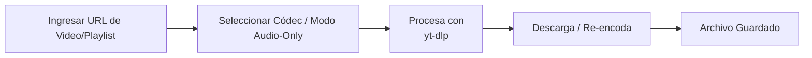

# YT Downloader con Flet y yt-dlp

Este repositorio contiene una aplicación de escritorio (incluida la opción web) escrita en [Flet](https://flet.dev/), diseñada para descargar videos (o solo audio) desde YouTube, con la finalidad de descargar videos propios de manera rápida en casos de recuperación de archivos. Internamente se basa en la librería [yt-dlp](https://github.com/yt-dlp/yt-dlp) para realizar la descarga y manipulación de videos.

## Tabla de Contenidos
- [Características Principales](#características-principales)
- [Requisitos](#requisitos)
- [Clonar el Repositorio](#clonar-el-repositorio)
- [Instalación de Flet y yt-dlp](#instalación-de-flet-y-yt-dlp)
- [Estructura de Archivos](#estructura-de-archivos)
- [Ejecución de la Aplicación](#ejecución-de-la-aplicación)
- [Construcción para Distintas Plataformas](#construcción-para-distintas-plataformas)
  - [Web](#web)
  - [Windows](#windows)
  - [Linux-y-macos](#linux-y-macos)

---

### Características Principales
1. **Descarga individual o de playlist**: Se proporciona una URL de YouTube (video suelto o playlist).
2. **Descarga solo audio** (modo audio) o video completo.
3. **Selección de códec** de video/audio o uso de “auto” para remux rápido.
4. **Carpeta de destino** configurable y soporte opcional de cookies.
5. **Interfaz Gráfica** sencilla construida con Flet.



---

### Requisitos
- **Python 3.9+**.
- **Flet** (para la interfaz).
- **yt-dlp** (para la descarga de videos).
- Sistema operativo: Windows, Linux o macOS.

---

### Clonar el Repositorio

```bash
git clone https://github.com/CarlosGiles/VideoDownloaderFletApp.git
cd downloader_venv
```

(Opcionalmente, hazlo en una ruta lo más corta posible, especialmente en Windows.)

---

### Instalación de Flet y yt-dlp

Para instalar localmente:

```bash
pip install flet yt-dlp
```

Si deseas aislar dependencias, crea un entorno virtual:

```bash
python -m venv venv
source venv/bin/activate  # En macOS / Linux
venv\Scripts\activate     # En Windows

pip install flet yt-dlp
```

---

### Estructura de Archivos

```bash
downloader_venv/
├── Include/
├── Lib/
├── Scripts/
├── share/
├── src/
│   ├── assets/                 # iconos u otros recursos
│   ├── components/             # controles personalizados de Flet
│   ├── scripts/                # lógica de descarga
│   ├── themes/                 # temas de Flet
│   └── main.py                 # punto de entrada de la app
├── storage/
├── .gitignore
├── descargas_registradas.txt
├── pyproject.toml
├── pyvenv.cfg
└── README.md    # Design Doc
LICENSE
README.md
```

---

### Ejecución de la Aplicación

1. **Activar el entorno virtual** (opcional).
2. Entrar a la carpeta raíz (donde está `pyproject.toml`).
3. Ejecutar el `main.py`:

```bash
python src/main.py
```

La aplicación abrirá una ventana nativa de Flet. Alternativamente, puedes correr la app en modo web:

```bash
flet run --web src/main.py
```

---

### Construcción para Distintas Plataformas

#### Web
Para construir una versión **web estática**:

```bash
flet build web
```
Genera en `build/web` los archivos listos para subir a un hosting estático.

#### Windows
Para empacar en **Windows** (un .exe + librerías):
```bash
flet build windows
```
Creará el ejecutable en `build/windows`. Asegúrate de haber activado el **Modo Desarrollador** en Windows (para symlinks) y de tener las rutas largas habilitadas, en caso de ser necesario.

#### Linux y macOS
En Linux:
```bash
flet build linux
```
En macOS:
```bash
flet build macos
```
Se genera un binario nativo en la carpeta `build/<plataforma>`.

---