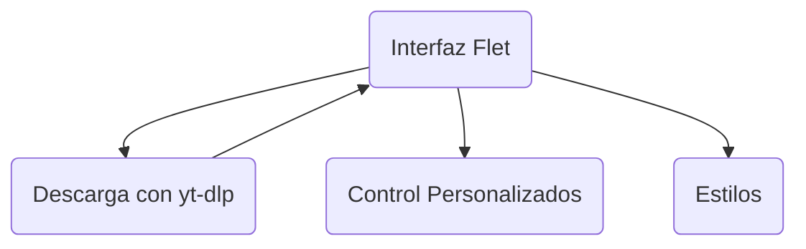
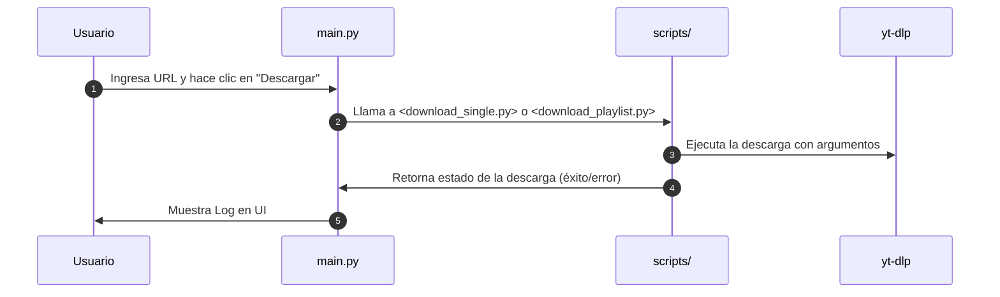

# Design Doc

Ahora tienes tu aplicación de descarga de YouTube funcionando con Flet y yt-dlp. Puedes personalizarla según tus necesidades e integrarla con otros componentes de tu flujo de trabajo.

---

## Diseño YouTube Downloader

Este documento describe la arquitectura interna y los componentes principales de la aplicación **YouTube Downloader** desarrollada con Flet y yt-dlp. Permite a otros desarrolladores comprender y extender la funcionalidad fácilmente.

---

## Tabla de Contenidos
- [Arquitectura General](#arquitectura-general)
- [Estructura de Archivos](#estructura-de-archivos)
- [Principales Módulos y Componentes](#principales-módulos-y-componentes)
  - [src/main.py](#srcmainpy)
  - [src/scripts](#srcscripts)
  - [src/components](#srccomponents)
  - [src/themes](#srcthemes)
- [Diagrama de Flujo Interno](#diagrama-de-flujo-interno)
- [Cómo Extender el Proyecto](#cómo-extender-el-proyecto)
- [Consideraciones Finales](#consideraciones-finales)

---

## Arquitectura General

La aplicación sigue una **arquitectura de capas** donde:
1. **Interfaz Flet (main.py)**: Maneja la UI, eventos de usuario y presentación.
2. **Scripts de descarga (scripts/)**: Encapsulan la lógica de descarga y conversión mediante [yt-dlp](https://github.com/yt-dlp/yt-dlp).
3. **Componentes de UI (components/)**: Pequeños controles personalizados de Flet.
4. **Temas (themes/)**: Personalizaciones de estilos y colores.



---

## Estructura de Archivos

```bash
downloader_venv/
├── Include/
├── Lib/
├── Scripts/
├── share/
├── src/
│   ├── assets/                 # iconos u otros recursos
│   ├── components/             # controles personalizados de Flet
│   ├── scripts/                # lógica de descarga
│   ├── themes/                 # temas de Flet
│   └── main.py                 # punto de entrada de la app
├── storage/
├── .gitignore
├── descargas_registradas.txt
├── pyproject.toml
├── pyvenv.cfg
└── README.md    # Design Doc
LICENSE
README.md
```

### Carpeta `src`
Contiene todo el código fuente. Dentro se organizan *components*, *scripts*, *themes*, etc.

### Carpeta `assets`
Lugar para íconos e imágenes. `icon.png` se usa para generar el icono de la app en Windows, Mac y Linux.

### Carpeta `storage`
Almacena archivos generados (descargas, logs o temporales).

---

## Principales Módulos y Componentes

### `src/main.py`
- **Punto de entrada** de la aplicación Flet.
- Define la función `main(page: ft.Page)` donde se configura la UI:
  - Campos de texto (`TextField`) para URL de video/playlist.
  - Botones para seleccionar carpeta de destino (`FilePicker`).
  - Dropdowns para elegir códecs de video/audio.
  - Checkbox para “Solo Audio”.
  - Botones de descarga que invocan a funciones de `scripts/`.

### `src/scripts`
En esta subcarpeta se aloja la **lógica de descarga** usando `yt_dlp`:

1. **`download_single.py`**: Descarga un único video.
2. **`download_playlist.py`**: Descarga una lista de reproducción, manejando archivos de registro para evitar duplicados.
3. **`download_only_audio.py`**: Extrae el audio de un video/playlist y lo convierte al códec deseado.
4. **`codecs_config.py`**: Define los códecs disponibles (h264, vp9, aac, etc.) y decide si se hace remux o re-encode.

### `src/components`
Contiene **controles reutilizables** en Flet:

1. **`btn.py`**: Define `PrimaryButton`, un `ElevatedButton` personalizado.
2. **`check.py`**: Provee `AudioOnlyCheckbox` para indicar “solo audio”.
3. **`btn_picker.py`**: Botones que abren los `FilePicker` (seleccionar carpeta o cookies).
4. `__init__.py`: Permite tratar la carpeta como un paquete Python.

### `src/themes`
- Almacena estilos de color, tipografías o configuraciones para cambiar la apariencia global de Flet.  
- Ejemplo: `theme_cyberpunk.py` (si estuviera implementado) define esquemas de color.

---

## Diagrama de Flujo Interno

Este diagrama describe cómo la UI interactúa con los scripts:



---

## Cómo Extender el Proyecto

1. **Agregar nuevos códecs**: Editar `codecs_config.py` e incluir la lógica en `FFMPEG_VIDEO_LIBS` o `FFMPEG_AUDIO_LIBS`.
2. **Nuevos componentes**: Crear archivos en `src/components` y reutilizarlos en `main.py`.
3. **Tema personalizado**: Editar o añadir archivos en `src/themes/`. Luego, en `main.py`, asignar `page.dark_theme = <mi_tema>` o `page.theme = <mi_tema>`.

---

## Consideraciones Finales
- **Rutas Largas en Windows**: Al compilar, ten en cuenta activar el Modo Desarrollador y minimizar la profundidad de las rutas.
- **Dependencias**: Asegúrate de incluir en el `pyproject.toml` cada librería externa (p. ej. `yt_dlp`) para que se empaquete correctamente.
- **Escalabilidad**: Dado que Flet usa `Flutter` por debajo, se pueden añadir animaciones, más UI, y adaptarlo a web, escritorio, y móvil.

¡Gracias por leer este Design Doc! Con esta información, podrás modificar y mantener el proyecto con mayor facilidad.

---